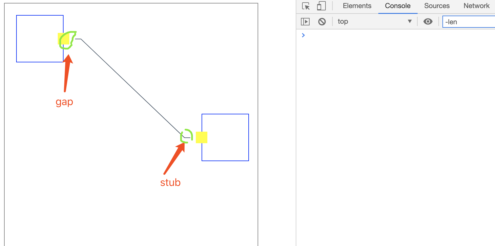
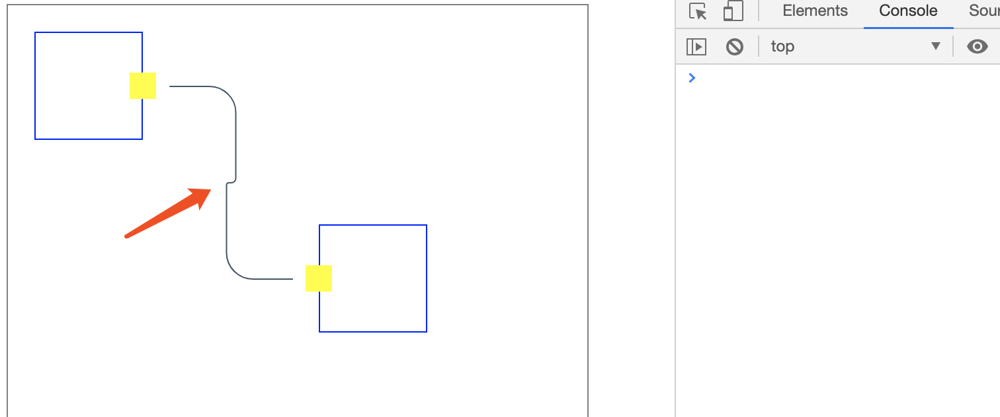
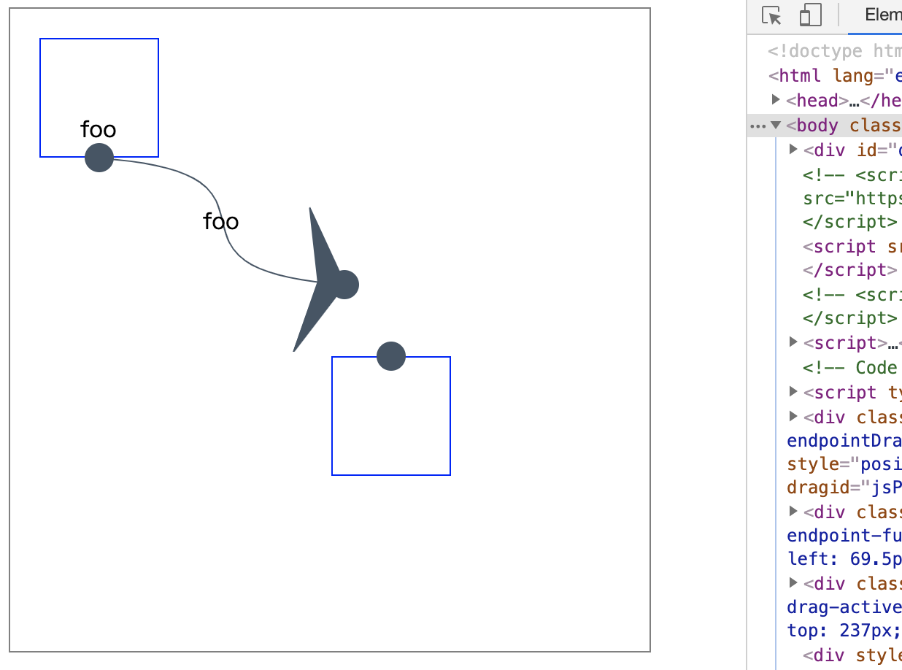
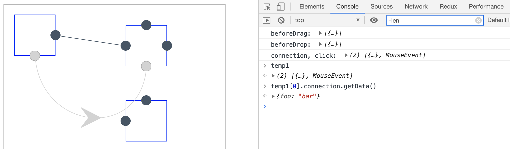

<details>
<summary>目录 TOC</summary>
<!-- TOC -->

- [1. jsplumb 中文基础教程](#1-jsplumb-%e4%b8%ad%e6%96%87%e5%9f%ba%e7%a1%80%e6%95%99%e7%a8%8b)
  - [1.1. 什么是jsplumb？](#11-%e4%bb%80%e4%b9%88%e6%98%afjsplumb)
  - [1.2. jsplumb能干什么？](#12-jsplumb%e8%83%bd%e5%b9%b2%e4%bb%80%e4%b9%88)
  - [1.3. 基本概念](#13-%e5%9f%ba%e6%9c%ac%e6%a6%82%e5%bf%b5)
    - [1.3.1. Anchors [todo]](#131-anchors-todo)
      - [静态锚点 Static Anchors](#%e9%9d%99%e6%80%81%e9%94%9a%e7%82%b9-static-anchors)
      - [动态锚点 Dynamic Anchors](#%e5%8a%a8%e6%80%81%e9%94%9a%e7%82%b9-dynamic-anchors)
      - [边缘锚点 Perimeter Anchors](#%e8%be%b9%e7%bc%98%e9%94%9a%e7%82%b9-perimeter-anchors)
      - [连续锚 Continuous Anchors](#%e8%bf%9e%e7%bb%ad%e9%94%9a-continuous-anchors)
    - [1.3.2. Connectors [todo]](#132-connectors-todo)
    - [1.3.3. Endpoints [todo]](#133-endpoints-todo)
      - [Endpoint 实例参数、属性、方法](#endpoint-%e5%ae%9e%e4%be%8b%e5%8f%82%e6%95%b0%e5%b1%9e%e6%80%a7%e6%96%b9%e6%b3%95)
    - [1.3.4. Overlays [todo]](#134-overlays-todo)
      - [Overlays 类型](#overlays-%e7%b1%bb%e5%9e%8b)
      - [Overlasy Location 覆盖物的位置](#overlasy-location-%e8%a6%86%e7%9b%96%e7%89%a9%e7%9a%84%e4%bd%8d%e7%bd%ae)
      - [Add Overlays](#add-overlays)
      - [其他方法](#%e5%85%b6%e4%bb%96%e6%96%b9%e6%b3%95)
    - [1.3.5. Groups [todo]](#135-groups-todo)
  - [1.4. 样式设置 [todo]](#14-%e6%a0%b7%e5%bc%8f%e8%ae%be%e7%bd%ae-todo)
- [2. 基础demos](#2-%e5%9f%ba%e7%a1%80demos)
  - [2.1. 连接两个节点](#21-%e8%bf%9e%e6%8e%a5%e4%b8%a4%e4%b8%aa%e8%8a%82%e7%82%b9)
    - [jsPlumb.connect 参数](#jsplumbconnect-%e5%8f%82%e6%95%b0)
  - [2.2. 可拖动节点](#22-%e5%8f%af%e6%8b%96%e5%8a%a8%e8%8a%82%e7%82%b9)
    - [元素设置可拖拽](#%e5%85%83%e7%b4%a0%e8%ae%be%e7%bd%ae%e5%8f%af%e6%8b%96%e6%8b%bd)
  - [2.3. 连接的其他参数](#23-%e8%bf%9e%e6%8e%a5%e7%9a%84%e5%85%b6%e4%bb%96%e5%8f%82%e6%95%b0)
  - [2.4. 设置连接的默认值](#24-%e8%ae%be%e7%bd%ae%e8%bf%9e%e6%8e%a5%e7%9a%84%e9%bb%98%e8%ae%a4%e5%80%bc)
  - [2.5. 给连接加上样式](#25-%e7%bb%99%e8%bf%9e%e6%8e%a5%e5%8a%a0%e4%b8%8a%e6%a0%b7%e5%bc%8f)
  - [2.6. 给连接加上箭头](#26-%e7%bb%99%e8%bf%9e%e6%8e%a5%e5%8a%a0%e4%b8%8a%e7%ae%ad%e5%a4%b4)
  - [2.7. 增加一个端点](#27-%e5%a2%9e%e5%8a%a0%e4%b8%80%e4%b8%aa%e7%ab%af%e7%82%b9)
  - [2.8. 拖动创建连接](#28-%e6%8b%96%e5%8a%a8%e5%88%9b%e5%bb%ba%e8%bf%9e%e6%8e%a5)
  - [2.9. 给端点增加样式](#29-%e7%bb%99%e7%ab%af%e7%82%b9%e5%a2%9e%e5%8a%a0%e6%a0%b7%e5%bc%8f)
  - [2.10. 节点改变尺寸](#210-%e8%8a%82%e7%82%b9%e6%94%b9%e5%8f%98%e5%b0%ba%e5%af%b8)
    - [重新绘制元素](#%e9%87%8d%e6%96%b0%e7%bb%98%e5%88%b6%e5%85%83%e7%b4%a0)
  - [2.11. 限制节点拖动区域](#211-%e9%99%90%e5%88%b6%e8%8a%82%e7%82%b9%e6%8b%96%e5%8a%a8%e5%8c%ba%e5%9f%9f)
  - [2.12. 节点网格对齐](#212-%e8%8a%82%e7%82%b9%e7%bd%91%e6%a0%bc%e5%af%b9%e9%bd%90)
  - [2.13. 给连接添加点击事件：点击删除连线](#213-%e7%bb%99%e8%bf%9e%e6%8e%a5%e6%b7%bb%e5%8a%a0%e7%82%b9%e5%87%bb%e4%ba%8b%e4%bb%b6%e7%82%b9%e5%87%bb%e5%88%a0%e9%99%a4%e8%bf%9e%e7%ba%bf)
  - [2.14. 删除节点，包括节点相关的连接](#214-%e5%88%a0%e9%99%a4%e8%8a%82%e7%82%b9%e5%8c%85%e6%8b%ac%e8%8a%82%e7%82%b9%e7%9b%b8%e5%85%b3%e7%9a%84%e8%bf%9e%e6%8e%a5)
  - [2.15. 通过编码连接endPoint](#215-%e9%80%9a%e8%bf%87%e7%bc%96%e7%a0%81%e8%bf%9e%e6%8e%a5endpoint)
  - [2.16. 连接前的检查，判断是否建立连接](#216-%e8%bf%9e%e6%8e%a5%e5%89%8d%e7%9a%84%e6%a3%80%e6%9f%a5%e5%88%a4%e6%96%ad%e6%98%af%e5%90%a6%e5%bb%ba%e7%ab%8b%e8%bf%9e%e6%8e%a5)
  - [2.17. 一个端点如何拖拽出多条连线](#217-%e4%b8%80%e4%b8%aa%e7%ab%af%e7%82%b9%e5%a6%82%e4%bd%95%e6%8b%96%e6%8b%bd%e5%87%ba%e5%a4%9a%e6%9d%a1%e8%bf%9e%e7%ba%bf)
  - [2.18. 整个节点作为source或者target](#218-%e6%95%b4%e4%b8%aa%e8%8a%82%e7%82%b9%e4%bd%9c%e4%b8%basource%e6%88%96%e8%80%85target)
  - [2.19. 节点缩放](#219-%e8%8a%82%e7%82%b9%e7%bc%a9%e6%94%be)
    - [Zooming 缩放](#zooming-%e7%bc%a9%e6%94%be)
- [3. jsPlumb事件列表](#3-jsplumb%e4%ba%8b%e4%bb%b6%e5%88%97%e8%a1%a8)
  - [3.1. 常用事件](#31-%e5%b8%b8%e7%94%a8%e4%ba%8b%e4%bb%b6)
    - [3.1.1. connection 连接建立时触发](#311-connection-%e8%bf%9e%e6%8e%a5%e5%bb%ba%e7%ab%8b%e6%97%b6%e8%a7%a6%e5%8f%91)
    - [3.1.2. connectionDetached 连接断开时触发](#312-connectiondetached-%e8%bf%9e%e6%8e%a5%e6%96%ad%e5%bc%80%e6%97%b6%e8%a7%a6%e5%8f%91)
    - [3.1.3. connectionMoved 连接移动事件](#313-connectionmoved-%e8%bf%9e%e6%8e%a5%e7%a7%bb%e5%8a%a8%e4%ba%8b%e4%bb%b6)
    - [3.1.4. connectionAborted 连接取消事件](#314-connectionaborted-%e8%bf%9e%e6%8e%a5%e5%8f%96%e6%b6%88%e4%ba%8b%e4%bb%b6)
    - [3.1.5. click 连接点击事件](#315-click-%e8%bf%9e%e6%8e%a5%e7%82%b9%e5%87%bb%e4%ba%8b%e4%bb%b6)
    - [3.1.6. dblclick 连接双击事件](#316-dblclick-%e8%bf%9e%e6%8e%a5%e5%8f%8c%e5%87%bb%e4%ba%8b%e4%bb%b6)
    - [3.1.7. connectionDrag 连接拖动事件](#317-connectiondrag-%e8%bf%9e%e6%8e%a5%e6%8b%96%e5%8a%a8%e4%ba%8b%e4%bb%b6)
    - [3.1.8. connectionDragStop 连接停止拖动事件](#318-connectiondragstop-%e8%bf%9e%e6%8e%a5%e5%81%9c%e6%ad%a2%e6%8b%96%e5%8a%a8%e4%ba%8b%e4%bb%b6)
    - [3.1.9. endpointClick 端点单击事件](#319-endpointclick-%e7%ab%af%e7%82%b9%e5%8d%95%e5%87%bb%e4%ba%8b%e4%bb%b6)
    - [3.1.10. endpointDblClick 端点双击事件](#3110-endpointdblclick-%e7%ab%af%e7%82%b9%e5%8f%8c%e5%87%bb%e4%ba%8b%e4%bb%b6)
    - [3.1.11. contextmenu 鼠标右键事件](#3111-contextmenu-%e9%bc%a0%e6%a0%87%e5%8f%b3%e9%94%ae%e4%ba%8b%e4%bb%b6)
    - [3.1.12. beforeDrop 连接建立前事件](#3112-beforedrop-%e8%bf%9e%e6%8e%a5%e5%bb%ba%e7%ab%8b%e5%89%8d%e4%ba%8b%e4%bb%b6)
    - [3.1.13. beforeDetach 连接断开前事件](#3113-beforedetach-%e8%bf%9e%e6%8e%a5%e6%96%ad%e5%bc%80%e5%89%8d%e4%ba%8b%e4%bb%b6)
    - [3.1.14. zoom 缩放事件](#3114-zoom-%e7%bc%a9%e6%94%be%e4%ba%8b%e4%bb%b6)
  - [3.2. 其他事件](#32-%e5%85%b6%e4%bb%96%e4%ba%8b%e4%bb%b6)
    - [3.2.1. Connection Events](#321-connection-events)
    - [3.2.2. Endpoint Events](#322-endpoint-events)
    - [3.2.3. Overlay Events](#323-overlay-events)
    - [3.2.4. Unbinding Events](#324-unbinding-events)
  - [3.3. 拦截器 - Interceptors](#33-%e6%8b%a6%e6%88%aa%e5%99%a8---interceptors)
    - [beforeDrop 连接建立前](#beforedrop-%e8%bf%9e%e6%8e%a5%e5%bb%ba%e7%ab%8b%e5%89%8d)
    - [beforeDetach 连接断开前](#beforedetach-%e8%bf%9e%e6%8e%a5%e6%96%ad%e5%bc%80%e5%89%8d)
    - [beforeDrag 连接拖拽前](#beforedrag-%e8%bf%9e%e6%8e%a5%e6%8b%96%e6%8b%bd%e5%89%8d)
    - [beforeStartDetach 连接开始断开](#beforestartdetach-%e8%bf%9e%e6%8e%a5%e5%bc%80%e5%a7%8b%e6%96%ad%e5%bc%80)
- [4. jsPlumb默认配置简介](#4-jsplumb%e9%bb%98%e8%ae%a4%e9%85%8d%e7%bd%ae%e7%ae%80%e4%bb%8b)
  - [默认值](#%e9%bb%98%e8%ae%a4%e5%80%bc)
  - [默认参数的简介](#%e9%bb%98%e8%ae%a4%e5%8f%82%e6%95%b0%e7%9a%84%e7%ae%80%e4%bb%8b)
  - [通过 getInstance 提供默认值](#%e9%80%9a%e8%bf%87-getinstance-%e6%8f%90%e4%be%9b%e9%bb%98%e8%ae%a4%e5%80%bc)
- [5. 工具函数](#5-%e5%b7%a5%e5%85%b7%e5%87%bd%e6%95%b0)
  - [5.1. 重绘某个元素 jsPlumb.revalidate](#51-%e9%87%8d%e7%bb%98%e6%9f%90%e4%b8%aa%e5%85%83%e7%b4%a0-jsplumbrevalidate)
  - [5.2. 重绘所有元素 jsPlumb.repaintEverything](#52-%e9%87%8d%e7%bb%98%e6%89%80%e6%9c%89%e5%85%83%e7%b4%a0-jsplumbrepainteverything)
  - [5.3. 重设节点ID jsPlumb.setId](#53-%e9%87%8d%e8%ae%be%e8%8a%82%e7%82%b9id-jsplumbsetid)
  - [5.4. 删除节点 jsPlumb.remove](#54-%e5%88%a0%e9%99%a4%e8%8a%82%e7%82%b9-jsplumbremove)
  - [5.5. 清空所有节点连接和端点 jsPlumb.empty](#55-%e6%b8%85%e7%a9%ba%e6%89%80%e6%9c%89%e8%8a%82%e7%82%b9%e8%bf%9e%e6%8e%a5%e5%92%8c%e7%ab%af%e7%82%b9-jsplumbempty)
  - [5.6. 移除连线 jsPlumb.detach](#56-%e7%a7%bb%e9%99%a4%e8%bf%9e%e7%ba%bf-jsplumbdetach)
  - [5.7. 移除某个节点上的所有连线 jsPlumb.deleteConnectionsForElement](#57-%e7%a7%bb%e9%99%a4%e6%9f%90%e4%b8%aa%e8%8a%82%e7%82%b9%e4%b8%8a%e7%9a%84%e6%89%80%e6%9c%89%e8%bf%9e%e7%ba%bf-jsplumbdeleteconnectionsforelement)
  - [5.8. 移除所有节点上的连线 jsPlumb.deleteEveryConnection()](#58-%e7%a7%bb%e9%99%a4%e6%89%80%e6%9c%89%e8%8a%82%e7%82%b9%e4%b8%8a%e7%9a%84%e8%bf%9e%e7%ba%bf-jsplumbdeleteeveryconnection)
  - [5.9. 移除某个节点上的端点](#59-%e7%a7%bb%e9%99%a4%e6%9f%90%e4%b8%aa%e8%8a%82%e7%82%b9%e4%b8%8a%e7%9a%84%e7%ab%af%e7%82%b9)
  - [5.10. 移除所有节点上的端点](#510-%e7%a7%bb%e9%99%a4%e6%89%80%e6%9c%89%e8%8a%82%e7%82%b9%e4%b8%8a%e7%9a%84%e7%ab%af%e7%82%b9)
  - [5.11. 元素的显示与隐藏](#511-%e5%85%83%e7%b4%a0%e7%9a%84%e6%98%be%e7%a4%ba%e4%b8%8e%e9%9a%90%e8%97%8f)
- [6. 样式修改](#6-%e6%a0%b7%e5%bc%8f%e4%bf%ae%e6%94%b9)
  - [6.1. 通过css添加样式](#61-%e9%80%9a%e8%bf%87css%e6%b7%bb%e5%8a%a0%e6%a0%b7%e5%bc%8f)
  - [6.2. paintStyle属性添加](#62-paintstyle%e5%b1%9e%e6%80%a7%e6%b7%bb%e5%8a%a0)
- [7. 查询 [todo]](#7-%e6%9f%a5%e8%af%a2-todo)
- [8. 视图与数据结构同步](#8-%e8%a7%86%e5%9b%be%e4%b8%8e%e6%95%b0%e6%8d%ae%e7%bb%93%e6%9e%84%e5%90%8c%e6%ad%a5)
- [9. 有没有稍微复杂一点，带有拖放的栗子？](#9-%e6%9c%89%e6%b2%a1%e6%9c%89%e7%a8%8d%e5%be%ae%e5%a4%8d%e6%9d%82%e4%b8%80%e7%82%b9%e5%b8%a6%e6%9c%89%e6%8b%96%e6%94%be%e7%9a%84%e6%a0%97%e5%ad%90)
- [10. 还有哪些类似的图形连线可视化项目](#10-%e8%bf%98%e6%9c%89%e5%93%aa%e4%ba%9b%e7%b1%bb%e4%bc%bc%e7%9a%84%e5%9b%be%e5%bd%a2%e8%bf%9e%e7%ba%bf%e5%8f%af%e8%a7%86%e5%8c%96%e9%a1%b9%e7%9b%ae)
  - [10.1. G6 AntV](#101-g6-antv)
  - [10.2. VivaGraphJS](#102-vivagraphjs)
  - [10.3. springy](#103-springy)
  - [10.4. graphviz](#104-graphviz)
  - [10.5. visjs](#105-visjs)
- [11. 参考资源](#11-%e5%8f%82%e8%80%83%e8%b5%84%e6%ba%90)

<!-- /TOC -->
</details>

# 1. jsplumb 中文基础教程

后续更新会在仓库：https://github.com/wangduanduan/jsplumb-chinese-tutorial.git

> 阅读建议：由于本教程目录太多，建议安装谷歌浏览器插件[Smart TOC](https://chrome.google.com/webstore/detail/smart-toc/lifgeihcfpkmmlfjbailfpfhbahhibba)，方便目录按照目录跳转查看。

## 1.1. 什么是jsplumb？
你有没有想过在你的网站上展示图表或者甚至在浏览器应用程序中使用它？用jsPlumb你可以！它是完全免费的，并根据MIT许可证提供。您可以直接从jsPlumb github网站下载框架。

该项目主要由Simon Porritt开发，他在澳大利亚西德尼担任网络开发人员。 jsPlumb由他积极开发。作为许多优秀的开发人员，他似乎更喜欢开发代码而不是编写教程，这就是为什么我提供一个简单的入门教程。


## 1.2. jsplumb能干什么？

那么如果你应该使用它取决于你想用jsPlumb做什么。该框架适用于必须绘制图表的Web应用程序，例如类似于Visio的应用程序或工作流程设计器等。由于图表项目和连接的所有参数都是非常精细可控的，因此您可以绘制您可以想到的任何类型的图表的！

## 1.3. 基本概念

- Souce 源节点
- Target 目标节点
- Anchor 锚点 锚点位于源节点或者目标节点上
- Endpoint 端点 端点位于连线上
- Connector 连接 或者也可以理解是连接线
- Overlays 可以理解为在连接线上的文字或者箭头之类的东东


### 1.3.1. Anchors [todo]
锚点类型：
- 静态锚点 - 固定在父元素上的某个点不能移动
- 动态锚点
- 边缘锚点
- 固定锚点

[官方文档：Anchors 锚点](https://jsplumb.github.io/jsplumb/anchors.html)

#### 静态锚点 Static Anchors

jsPlumb 有九个默认的锚点位置，可以用于指定连接器连接到元素的位置。他们是元素的四个角、元素中心和元素每条边的中点。
- `Top` === `TopCenter` === `[0.5, 0, 0, -1]` 
- `TopRight`
- `Right` === `RightMiddle`
- `BottomRight`
- `Bottom` === `BottomCenter`
- `BottomLeft`
- `Left` === `LeftMiddle` === `[0, 0.5, -1, 0]` 
- `TopLeft`
- `Center`

这些特殊的字符串底层实际上是基于数组语法的简写 `[x, y, dx, dy]` 。`x, y` 是以左上角为原点，横向 x 轴，竖向 y 轴，取值为 `[0, 1]` 。`dx, dy` 指定与锚点关联的曲线的方向值，取值为 `0,1,-1`。

```js
jsPlumb.connect({...., anchor:"Bottom", ... });
// 等同于
jsPlumb.connect({...., anchor:[ 0.5, 1, 0, 1 ], ... });
```


**锚点偏移**

数组语法除了给定锚点的位置与方向外，还可以提供两个参数，用于定义距给定的位置以像素为单位的偏移量

`jsPlumb.connect({...., anchor:[ 0.5, 1, 0, 1, 0, 50 ], ... })` Bottom 位置的锚点，向下偏移 50px

#### 动态锚点 Dynamic Anchors

提供一组锚点位置，当物体重绘或者物体移动时，会选择最合适的一个。

可以使用数组语法、简写语法、混合语法。jsPlumb 提供了一个默认简写值 `AutoDefault` ，是 `Top/Right/Bottom/Left` 的集合

```js
var dynamicAnchors = [ [ 0.2, 0, 0, -1 ],  [ 1, 0.2, 1, 0 ], 
               "Top", "Bottom" ];
jsPlumb.connect({...., anchor:dynamicAnchors, ... });
```

#### 边缘锚点 Perimeter Anchors

这些是在给定形状周边上的锚点。本质上，这是一些动态锚点，其位置是从基础形状的周边选择的。jsPlumb 支持六种形状。

- `Circle` - 圆
- `Ellipse` - 椭圆
- `Triangle` - 三角形
- `Diamond` - 菱形
- `Rectangle` - 矩形
- `Square` - 正方形

```js
jsPlumb.addEndpoint("someElement", {
  endpoint:"Dot",
  anchor:[ "Perimeter", { shape:"Circle" } ]
});
```

#### 连续锚 Continuous Anchors 

这些锚点不固定在特定的位置。其根据关联连接器上的另一个元素的方向，将他们分配到元素的某一面上。与静态锚点和动态锚点相比较，其计算量稍高，因为需要计算绘制周期中，每个连接的位置，而不仅仅是属于运动元素的连接。


### 1.3.2. Connectors [todo]
连线类型：
- `Bezier`: 贝塞尔曲线
  - `curviness`(弯曲度) 默认为 150，定义了 Bezier 的控制点到锚点的距离
- `Straight`: 直线
  - `stub` 默认为 0；短线（线头），从端点发出，垂直与当前端点所在面
  - `gap` 默认为 0
- `Flowchart` 90度转角线，垂直或水平线组成典型的流程图外观。支持回环连接，即在同一元素上开始和结束连接
  - `stub` - 默认 30 ；整数 - 指定每一段的 stub 长度；数组 - [sourceStub, targetStub]
  - `alwaysRespectStubs` - 默认 false；总是尊重短线，即 true，当元素间距小于两个短线之和时，stub 依旧不减少；反之则减少
  - `gap` - 默认 0
  - `midpoint` - 默认 0.5；
  - `cornerRadius` - 默认 0；流程图的直角变成弧度
- `StateMachine` 状态机；绘制稍微弯曲的线（二次贝塞尔曲线）。支持回环连接，这种情况下是一个圆。
  - `margin` - 边距 默认 5
  - `curviness` - 弯曲度默认 10
  - `proximityLimit` - 接近度限制 默认 80

[官方文档：连线类型以及参数](https://docs.jsplumbtoolkit.com/toolkit/current/articles/connectors.html)
[官方 DOC: Connectors](https://jsplumb.github.io/jsplumb/connectors.html)

<details>
<summary>Straight 示例</summary>

```js
// Straight 示例
jsPlumb.connect({
  source: "item_left",
  target: "item_right",
  connector: ['Straight', {stub: 10, gap: 20}],
  anchor: ["Right", "Left"]
});
jsPlumb.draggable("item_right");
```


</details>


<details>
<summary>Flowchart 示例</summary>

```js
jsPlumb.connect({
  source: "item_left",
  target: "item_right",
  connector: ['Flowchart', {
    stub: 50,
    alwaysRespectStubs: true,
    gap: 20,
    midpoint: 0.5,
    cornerRadius: 20
  }],
  anchor: ["Right", "Left"]
});
jsPlumb.draggable("item_right");
```

图中箭头指示的拐点：midpoint 指定，如果是 0，观点靠近 source 端

</details>

### 1.3.3. Endpoints [todo]

[官网：Endpoints-api](https://github.com/jsplumb/jsplumb/blob/da6688b86fbfba621bf3685e4431a4d9be7213b4/doc/api/endpoint-api.js) 

链接器的一端。端点有一个底层锚点，决定了端点的位置。每一个端点上可以有 `[0, maxConnections]` 的连接（默认是 1，如果设置 `maxConnections=-1` ，则不限制连接数）。

你不需要直接创建端点，只需向适当的 JSPlumb 方法提供端点定义即可。

1. `String` - 有效的端点名，如 Dot、Rectangle。
2. `[String, Object]` 数组 - 有效的端点名，对应的参数


端点类型:
- `Dot` 圆点
  - `radius`  - 整数，默认 10px；可选；定义原点的半径。
  - `cssClass`  - 字符串；可选；附加到端点上的 CSS 类
  - `hoverClass` - 字符串；可选；鼠标悬停在端点上附加的类名
- `Rectangle` 矩形
  - `width` - 整数，默认 20；
  - `height` - 整数，默认 20；
  - `cssClass/hoverClass`
- `Image` 图像
  - `src` - 要显示的图片的地址
  - `cssClass/hoverClass`
- `Blank`  空白

对于 `cssClass` 与 `hoverClass` 参数类型可以是单个类名、多个类名使用空格分开，如`dot-a dot-b`

不能通过 CSS 样式来修改端点的大小，会造成端点在元素上的位置不准确。如等 Type 为 Image 是，插件会自动读取图片的大小


#### Endpoint 实例参数、属性、方法

可以利用 `addEndpoint()` 方法（返回新创建的端点）查看。

实例参数

| 参数              | 参数类型       | 是否必须 | 说明                                                         |
| ----------------- | -------------- | -------- | ------------------------------------------------------------ |
| params            | Object         | 是       | 构造函数的参数                                               |
| {}.anchor         | String\|Array  | 否       | 定义端点的锚点                                               |
| {}.isSource       | Boolean-false  | 否       | 指示端点可以作为新连接的源                                   |
| {}.isTarget       | ..             | ..       |                                                              |
| {}.connector      | String\|Object | 否       | 要使用的链接器的类型。已知连接器类型的单个字符串 `Bezier` 。或一个数组 `[name, params]` 如 `[ "Bezier", { curviness:160 } ]` |
| {}.maxConnections | Integer 整数   | 否       | 默认 1                                                       |


### 1.3.4. Overlays [todo]

[官网：Overlays ](https://jsplumb.github.io/jsplumb/overlays.html)

Overlays 可以理解为在连接线上的文字或者箭头之类的东东

#### Overlays 类型

- `Arrow` - 箭头 可配置折线箭头；由四个点控制：头部(head)、两个尾部点(tail points)、折返点(foldback)（允许缩进箭头的尾部）
  - `width` - 箭尾的宽度
  - `length` - 箭尾到箭头的距离
  - `location` - 覆盖物出现在连线上的位置；
    - [0, 1]：从 source 到 target 按比例出现
    - 大于 1 的整数：到 source 的绝对距离
    - 小于 -1 的整数：到 target 的绝对距离
  - `direction`: 箭头的方向（source -> target）; 1 - 正向； -1 - 反向
  - `foldback`: 折返点到箭头的距离（比例），默认 0.623
  - `paintStyle`
- `Label` - 标签
  - `label` 要显示的文本
  - `cssClass`
  - `labelStyle` - `{font: '', fill: '', color: '', padding: '', borderWidth: '', borderStyle: ''}`
  - `location`
- `PlainArrow` - 平箭头（没有折叠）Arrow 的 foldback=1的特殊实例
- `Diamond` - 钻石（菱形）Arrow 的 foldback=2的特殊实例
- `Custom` - 可以是任意的 DOM 元素
  - 需要使用 `create()` 返回 DOM 元素或者有效的选择器

#### Overlasy Location 覆盖物的位置

- `[0, 1]` 链接器上的比例值；0.5 代表连接器的点
- 大于 1 的整数，表示从起点沿连接器移动的绝对像素值
- 小于 0 的整数，反向
- 对于端点，适用同样的规则；但 location 被指定为 [x, y] 数组，是指位于端点中心的叠加层

可以通过：
- `getLocation` - 返回当前的位置
- `setLocation` - 设置当前的位置

#### Add Overlays

可以通过 `jsPlumb.connect`, `jsPlumb.addEndpoint`, `jsPlumb.makeSource`(不能是 `jsPlumb.makeTarget`, 覆盖总是在连接源定义的)。

还可以使用 `addOverlay` 给连接或端点添加覆盖；

```js
var e = jsPlumb.addEndpoint("someElement");
e.addOverlay([ "Arrow", { width:10, height:10, id:"arrow" }]); 
```

<details>
<summary>详细示例</summary>

1、使用 `jsPlumb.connect` 定义

带有默认选项的箭头，以及一个 “foo” 的文本标签
```js
jsPlumb.connect({
  ...
  overlays:[ 
    "Arrow", 
      [ "Label", { label:"foo", location:0.25, id:"myLabel" } ] // 可以通过 ID 删除此覆盖物或者修改其可见性
    ],
  ...
});
```

```js
// 连线上overlay可以多个，
// 每个overlay可以指定相对位置
// label类型的overlay实际上可以在里面直接写html
// 
jsPlumb.connect({
  ...
  connectorOverlays: [
    ['Arrow', {
      width: 10,
      length: 10,
      location: 1
    }],
    ['Label', {
      label: '<button class="delete-node-btn">X</button>',
      cssClass: '',
      labelStyle: {
        color: 'red'
      },
      events: {
        click: function (labelOverlay, originalEvent) {
          console.log('click on label overlay for :' + labelOverlay.component)
          console.log(labelOverlay)
          console.log(originalEvent)
        }
      }
    }]
  ]
});
```

2、通过 `jsPlumb.addEndpoint` 调用

在这个例子中，使用 `connectorOverlays` 而不是 `overlays`。因为新的覆盖将引用端点的覆盖

```js
jsPlumb.addEndpoint("someDiv", {
  ...
  overlays:[
    [ "Label", { label:"foo", id:"label", location:[-0.5, -0.5] } ]
  ],
  connectorOverlays:[ 
    [ "Arrow", { width:10, length:30, location:1, id:"arrow" } ],
    [ "Label", { label:"foo", id:"label" } ]
  ],
  ...
});
```



3、通过 `jsPlumb.makeSource` 调用

注意：同样是用 `connectorOverlays`

```js
jsPlumb.makeSource("someDiv", {
  ...
  endpoint:{
    connectorOverlays:[ 
      [ "Arrow", { width:10, length:30, location:1, id:"arrow" } ], 
      [ "Label", { label:"foo", id:"label" } ]
    ]
  }
  ...
});
```

</details>


#### 其他方法

**显示隐藏 Overlays**
```js
var overlay = connection.getOverlay("myLabel");

// now you can hide this Overlay:
overlay.setVisible(false);

// there are also hide/show methods:
overlay.show();
overlay.hide();

connection.hideOverlay("myLabel");
connection.showOverlay("myLabel");
```

**Removing Overlays**

```js
var connection = jsPlumb.connect({
  ...
  overlays:[ 
    "Arrow", 
    [ "Label", { label:"foo", location:0.25 }, id:"myLabel" ]
  ],
  ...
});     

// time passes
connection.removeOverlay("myLabel");
```


### 1.3.5. Groups [todo]

包含在某个元素中的一组元素，可以折叠，折叠后，连接到组成员上的连线被合并到组的折叠元素上。

## 1.4. 样式设置 [todo]

# 2. 基础demos

## 2.1. 连接两个节点

demo: https://wdd.js.org/jsplumb-chinese-tutorial/demos/01.html

<iframe height="265" style="width: 100%;" scrolling="no" title="MWwaJye" src="https://codepen.io/yang-yibu/embed/MWwaJye?height=265&theme-id=default&default-tab=html,result" frameborder="no" allowtransparency="true" allowfullscreen="true">
  See the Pen <a href='https://codepen.io/yang-yibu/pen/MWwaJye'>MWwaJye</a> by 一步
  (<a href='https://codepen.io/yang-yibu'>@yang-yibu</a>) on <a href='https://codepen.io'>CodePen</a>.
</iframe>

jsPlumb.ready方法和jquery的ready方法差不多的功能，jsPlumb.connect用于建立连线


```html
<div id="diagramContainer">
    <div id="item_left" class="item"></div>
    <div id="item_right" class="item" style="margin-left:50px;"></div>
  </div>
  <script src="https://cdn.bootcss.com/jsPlumb/2.6.8/js/jsplumb.min.js"></script>

  <script>
    /* global jsPlumb */
    jsPlumb.ready(function () {
      jsPlumb.connect({
        source: 'item_left',
        target: 'item_right',
        endpoint: 'Dot'
      })
    })
  </script>
```


### jsPlumb.connect 参数

参数说明：
jsPlumb.connect(config) return connection

参数 | 参数类型 | 是否必须 | 说明
---|---|---|---
source | String,Object,Endpoint | 是 | 连线源的标识，可以是id, element, 或者Endpoint
target | String,Object,Endpoint | 是 | 连线目标的标识，可以是id, element, 或者Endpoint
endpoint | String | 可选 | 端点类型，形状
uuids | String[] | 可选 | 要连接的两个端点（Endpoints）可选的 UUIDS 数组. 如果提供这个参数，就不需要提供 `source` 或 `target`<br />可以使用 [node-uuid](https://github.com/uuidjs/uuid) 生成唯一 uid 
type | String | 可选 | 可选的连接器（连线 Connection）的类型

[>>> connect方法详情](https://github.com/jsplumb/jsplumb/blob/da6688b86fbfba621bf3685e4431a4d9be7213b4/doc/api/jsplumb-api.js#L76)


## 2.2. 可拖动节点

demo: https://wdd.js.org/jsplumb-chinese-tutorial/demos/02.html


```html
<div id="diagramContainer">
    <div id="item_left" class="item"></div>
    <div id="item_right" class="item" style="left:150px;"></div>
  </div>
  <script src="https://cdn.bootcss.com/jsPlumb/2.6.8/js/jsplumb.min.js"></script>

  <script>
    /* global jsPlumb */
    jsPlumb.ready(function () {
      jsPlumb.connect({
        source: 'item_left',
        target: 'item_right',
        endpoint: 'Rectangle'
      })

      jsPlumb.draggable('item_left')
      jsPlumb.draggable('item_right')
    })
  </script>
```


### 元素设置可拖拽

使用draggable可以让节点被拖动，[API: draggable方法参考](https://github.com/jsplumb/jsplumb/blob/da6688b86fbfba621bf3685e4431a4d9be7213b4/doc/api/jsplumb-api.js#L690)

[官方 doc：Element Dragging](https://jsplumb.github.io/jsplumb/dragging.html)

Allowed Argument Types - 允许的参数类型

- 代表 Element ID 的字符串或其组成的类数组

- Element 或 其组成的类数组

  ```js
  jsPlumbInstance.draggable(["elementOne", "elementTwo"])
  jsPlumbInstance.draggable($(".someClass"));
  jsPlumbInstance.draggable(document.querySelectorAll(".someClass"));
  ```

必须设置的 CSS

必须要在拖拽的元素上设置 `position: absolute` 。因为实现拖拽是通过 left 和 top 属性来控制的。


## 2.3. 连接的其他参数

demo: https://wdd.js.org/jsplumb-chinese-tutorial/demos/03.html

可以通过connector去设置连接线的形状，如直线或者曲线之类的。anchor可以去设置锚点的位置。

jsplumb连线的样式有四种

- `Bezier`: 贝塞尔曲线
- `Flowchart`: 具有90度转折点的流程线
- `StateMachine`: 状态机
- `Straight`: 直线


```html
<div id="diagramContainer">
    <div id="item_left" class="item"></div>
    <div id="item_right" class="item" style="left:150px;"></div>
  </div>
  <script src="https://cdn.bootcss.com/jsPlumb/2.6.8/js/jsplumb.min.js"></script>

  <script>
    /* global jsPlumb */
    jsPlumb.ready(function () {
      jsPlumb.connect({
        source: 'item_left',
        target: 'item_right',
        endpoint: 'Rectangle',
        // ['连接器的类型', { 相应连接器类型的参数 }]
        connector: ['Bezier'],
        // 锚点位于各自父元素的位置
        anchor: ['Left', 'Right']
      })

      jsPlumb.draggable('item_left')
      jsPlumb.draggable('item_right')
    })
  </script>
```

## 2.4. 设置连接的默认值

demo: https://wdd.js.org/jsplumb-chinese-tutorial/demos/04.html 

在很多连线都是相同设置的情况下，可以将配置抽离出来，作为一个单独的变量，作为connect的第二个参数传入。实际上connect的第二个参数会和第一个参数merge，作为一个整体。

```html
<script>
    /* global jsPlumb */
    jsPlumb.ready(function () {
      var common = {
        endpoint: 'Rectangle',
        connector: ['Bezier'],
        anchor: ['Left', 'Right']
      }

      jsPlumb.connect({
        source: 'item_left',
        target: 'item_right'
      }, common)

      jsPlumb.draggable('item_left')
      jsPlumb.draggable('item_right')
    })
  </script>
```

## 2.5. 给连接加上样式

demo: https://wdd.js.org/jsplumb-chinese-tutorial/demos/05.html

例如给连线设置不同的颜色，设置不同的粗细之类的。


```javascript
jsPlumb.connect({
  source: 'item_left',
  target: 'item_right',
  paintStyle: { stroke: 'lightgray', strokeWidth: 3 },
  endpointStyle: { fill: 'lightgray', outlineStroke: 'darkgray', outlineWidth: 2 }
}, common)
```

[官网：paint-styles 绘制样式](https://jsplumb.github.io/jsplumb/paint-styles.html)


## 2.6. 给连接加上箭头

demo: https://wdd.js.org/jsplumb-chinese-tutorial/demos/06.html

箭头实际上是通过设置`overlays`去设置的，可以设置箭头的长宽以及箭头的位置，location 0.5表示箭头位于中间，location 1表示箭头设置在连线末端。 一根连线是可以添加多个箭头的。

`overlays`也是一个比较重要的概念，overlays可以理解为遮罩层。遮罩层不仅仅可以设置箭头，也可以设置其他内容。

overlays有五种类型，下面给出简介。具体使用方法参见 http://jsplumb.github.io/jsplumb/overlays.html

- `Arrow` 一个可配置的箭头
- `Label` 标签，可以在连接上显示文字信息
- `PlainArrow` 原始类型的箭头
- `Diamond` 菱形箭头
- `Custom` 自定义类型


```js
jsPlumb.connect({
  source: 'item_left',
  target: 'item_right',
  paintStyle: { stroke: 'lightgray', strokeWidth: 3 },
  endpointStyle: { fill: 'lightgray', outlineStroke: 'darkgray', outlineWidth: 2 },
  overlays: [ ['Arrow', { width: 12, length: 12, location: 0.5 }] ]
}, common)
```

## 2.7. 增加一个端点

demo: https://wdd.js.org/jsplumb-chinese-tutorial/demos/07.html

addEndpoint方法可以用来增加端点，[官网：addEndpoint ](https://github.com/jsplumb/jsplumb/blob/da6688b86fbfba621bf3685e4431a4d9be7213b4/doc/api/jsplumb-api.js#L57)

[官网：Endpoint 的具体参数](https://github.com/jsplumb/jsplumb/blob/da6688b86fbfba621bf3685e4431a4d9be7213b4/doc/api/endpoint-api.js#L57) 


```js
/**
 * 给给定的一个或多个元素添加端点
 * @method addEndpoint
 * @param {String|Object|Array} el - 要添加端点的元素。元素 ID、选择器、或者一个数组
 * @param {Object} [param] - 含有端点构造函数参数的对象
 * @param {object} [referenceParams] - 同上，使用与共享参数会与 param 合并
 * @return {Object | Array} 返回新创建的端点或由端点组成的数组
 */

jsPlumb.ready(function () {
  jsPlumb.addEndpoint('item_left', {
    // TODO: 看 API 文档明明只有 anchor(Object|Array) 参数，会什么使用 anchors 也是可以的
    anchors: ['Right']
  })
})
```

## 2.8. 拖动创建连接

demo: https://wdd.js.org/jsplumb-chinese-tutorial/demos/08.html

[官网 API: setContainer](https://github.com/jsplumb/jsplumb/blob/da6688b86fbfba621bf3685e4431a4d9be7213b4/doc/api/jsplumb-api.js) 

如果你将`isSource`和`isTarget`设置成true，那么就可以在用户拖动时，自动创建连接。


```js
jsPlumb.ready(function () {
      jsPlumb.setContainer('diagramContainer')

      var common = {
        isSource: true, // 表示这个端点可以作为新连接的源；默认是 false
        isTarget: true,
        connector: ['Straight'] // 查看 Endpoints 参数
      }

      jsPlumb.addEndpoint('item_left', {
        anchors: ['Right']
      }, common)

      jsPlumb.addEndpoint('item_right', {
        anchor: 'Left'
      }, common)

      jsPlumb.addEndpoint('item_right', {
        anchor: 'Right'
      }, common)
    })
```

`一般来说拖动创建的连接，可以再次拖动，让连接断开。如果不想触发这种行为，可以设置。`

```js
/**
 * 将给定的默认值导入此 jsPlumb 的示例中
 * jsplumb/doc/api/jsplumb-api.js
 * Configuring Defaults - https://jsplumb.github.io/jsplumb/defaults.html
 */
jsPlumb.importDefaults({
    ConnectionsDetachable: false // 链接可分开（可拆卸）
  })
```

`如果你需要在连接被拖动建立后，更新数据模型，则需要订阅connection事件`, 回调函数的info对象里，有你所需的任何数据。比如说从哪个节点拖动到哪个节点的。

关于事件，可以参考 `3. jsPlumb 事件列表` 章节。

```js
jsPlumb.bind("connection", function(info, originalEvent) {
   .. update your model in here, maybe.
});
```

## 2.9. 给端点增加样式

demo: https://wdd.js.org/jsplumb-chinese-tutorial/demos/09.html

通过设置各种 `*Style`来改变连接或者端点的样式。

[官方 DOC：Paint Styles - 绘制样式](https://jsplumb.github.io/jsplumb/paint-styles.html)


```
jsPlumb.ready(function () {
      jsPlumb.setContainer('diagramContainer')

      var common = {
        isSource: true,
        isTarget: true,
        connector: 'Straight',
        endpoint: 'Dot',
        paintStyle: {
          fill: 'white',
          outlineStroke: 'blue',
          strokeWidth: 3
        },
        hoverPaintStyle: {
          outlineStroke: 'lightblue'
        },
        connectorStyle: {
          outlineStroke: 'green',
          strokeWidth: 1
        },
        connectorHoverStyle: {
          strokeWidth: 2
        }
      }

      jsPlumb.addEndpoint('item_left', {
        anchors: ['Right']
      }, common)

      jsPlumb.addEndpoint('item_right', {
        anchor: 'Left'
      }, common)

      jsPlumb.addEndpoint('item_right', {
        anchor: 'Right'
      }, common)
    })
```

<a id="jump-resize"></a>
## 2.10. 节点改变尺寸

demo: https://wdd.js.org/jsplumb-chinese-tutorial/demos/10.html

jsplumb实际上不支持改变节点大小，实际上只能通过jquery ui resizable 方法去改变。


```html
<div id="diagramContainer">
  <div id="item_left" class="item"></div>
  <div id="item_right" class="item" style="left:150px;"></div>
</div>
<script src="https://code.jquery.com/jquery-1.11.3.js"></script>
<script src="https://code.jquery.com/ui/1.12.1/jquery-ui.js"></script>
<script src="./lib/jquery.jsplumb.js"></script>

<script>
  /* global jsPlumb, $ */
  $(".item").resizable({
    resize: function(event, ui) {
      // 锚点位置不动
      jsPlumb.repaint(ui.helper)
      //
      // jsPlumb.revalidate(ui.helper[0])
      // jsPlumb.repaintEverything();
    }
  });

  jsPlumb.ready(function() {
    jsPlumb.connect({
      source: "item_left",
      target: "item_right",
      endpoint: "Rectangle"
    });

    jsPlumb.draggable("item_left");
    jsPlumb.draggable("item_right");
  });
</script>
```


### 重新绘制元素

如果使用 `jsPlumb.draggable` 来初始化可拖动元素，通常情况下，不需要指示 jsPlumb 重新绘制。然而，在某些场景下是需要的：

- 重新调整了元素的大小，需要重新计算其上的端点位置
- 通过程序的方式移动了元素
- 实际上没有通过 `jsPlumb.draggable` 方法初始化某个可拖动的元素

[官方 API：repaint](https://github.com/jsplumb/jsplumb/blob/da6688b86fbfba621bf3685e4431a4d9be7213b4/doc/api/jsplumb-api.js#L611)

```js
/**
 * 重新绘制元素及其链接
 * @method repaint
 * @param {String|Element|Selector} el The element in question.
 * @return {jsPlumbInstance} The current jsPlumb instance.
 */
/**
 * 清除元素的偏移量和尺寸缓存，然后重新绘制及其链接
 * @method revalidate
 * @param {Strong|Element|Selector} el - 有问题的元素
 */
/**
 * 重新绘制所有的链接及端点
 * @method repaintEverything
 * @param {boolean} [clearEdits=false] - 如果是 true, 清除自上次绘制后所做的修改
 * @return {jsPlumbInstance} The current jsPlumb instance.
 * @see jsPlumbInstance#repaint
 */
```


## 2.11. 限制节点拖动区域

demo: https://wdd.js.org/jsplumb-chinese-tutorial/demos/11.html

默认情况下，节点可以被拖动到区域外边，如果想只能在区域内拖动，需要设置containment，这样节点只能在固定区域内移动。

实际上上这个功能是使用jQueryUI的功能，所以函数的使用可以参考jQueryUI的文档。https://jqueryui.com/draggable/#constrain-movement


```js
jsPlumb.draggable('item_left', {containment: 'parent'})
jsPlumb.draggable('item_right', {containment: 'parent'})
jsPlumb.draggable('some-id', {containment: "#containment-wrapper"})
```

## 2.12. 节点网格对齐

demo: https://wdd.js.org/jsplumb-chinese-tutorial/demos/12.html
网格对齐实际上是设置了`grid`属性，使移动只能按照固定的尺寸移动。然后用一张图作为背景铺开作为网格来实现的。


```html
<style>
#diagramContainer {
  padding: 20px;
  width: 80%;
  height: 400px;
  border: 1px solid gray;
  background-image: url(./images/20180227163310_1bVYeW_grid.jpeg);
  background-repeat: repeat;
}
</style>

<script>
jsPlumb.draggable('item_left', {
  containment: 'parent',
  grid: [10, 10] // 网格对其属性
})
</script>
```

## 2.13. 给连接添加点击事件：点击删除连线

demo: https://wdd.js.org/jsplumb-chinese-tutorial/demos/13.html


```js
// 请单点击一下连接线, 
jsPlumb.bind('click', function (conn, originalEvent) {
  if (window.prompt('确定删除所点击的连接吗？ 输入1确定') === '1') {
    jsPlumb.detach(conn) // 分离并清理给定的连接器
  }
})
```

jsPlumb支持许多事件

`jsPlumb Events列表`

- connection
- connectionDetached
- connectionMoved
- click
- dblclick
- endpointClick
- endpointDblClick
- contextmenu
- beforeDrop
- beforeDetach
- zoom
- Connection Events
- Endpoint Events
- Overlay Events
- Unbinding Events

参考用法参考：https://github.com/jsplumb/jsplumb/blob/da6688b86f/doc/wiki/events.md


## 2.14. 删除节点，包括节点相关的连接

demo: https://wdd.js.org/jsplumb-chinese-tutorial/demos/14.html


```js
// nodeId为节点id, remove方法可以删除节点以及和节点相关的连线
console.log('3 秒后移除左边节点包括它的连线')
setTimeout(function () {
  jsPlumb.remove('item_left')
}, 3000)
```

注意remove方法有些情况下是无法删除干净连线的，[官方 API：remove](https://github.com/jsplumb/jsplumb/blob/da6688b86fbfba621bf3685e4431a4d9be7213b4/doc/api/jsplumb-api.js#L648)

> 从 DOM 中删除给定的元素，以及与之相关的所有端点，以及他们之间的链接，也会删除所有子元素的端点及链接以及子元素本身

[官方 wiki：removing](https://jsplumb.github.io/jsplumb/removing.html)


## 2.15. 通过编码连接endPoint

demo: https://wdd.js.org/jsplumb-chinese-tutorial/demos/15.html


初始化数据后，给节点加上了endPoint, 如果想编码让endPoint连接上。需要在addEndpoint时，就给该断点加上一个uuid, 然后通过connect()方法，将两个断点连接上。建议使用[node-uuid](https://github.com/kelektiv/node-uuid)给每个端点都加上唯一的uuid， 这样以后连接就方便多了。

```js
jsPlumb.addEndpoint('item_left', {
  anchors: ['Right'],
  uuid: 'fromId'
})

jsPlumb.addEndpoint('item_right', {
  anchors: ['Left'],
  uuid: 'toId'
})

console.log('3 秒后建立连线')
setTimeout(function () {
  jsPlumb.connect({ uuids: ['fromId', 'toId'] })
}, 3000)
```


## 2.16. 连接前的检查，判断是否建立连接

demo: https://wdd.js.org/jsplumb-chinese-tutorial/demos/16.html


有时候当用户从A端点连接到B端点时，需要做一些检查，如果不符合条件，就不让连接建立。

```js
// 当连接建立前
jsPlumb.bind('beforeDrop', function (info) {
  var a = 10
  var b = 2
  if (a < b) {
    console.log('连接会自动建立')
    return true // 连接会自动建立
  } else {
    console.log('连接取消')
    return false // 连接不会建立，注意，必须是false
  }
})
```

## 2.17. 一个端点如何拖拽出多条连线

demo https://wdd.js.org/jsplumb-chinese-tutorial/demos/17.html

> 具体查看 1.3.3 Endpoint 具体参数

默认情况下，`maxConnections`的值是1，也就是一个端点最多只能拉出一条连线。

你也可以设置成其他值，例如5，表示最多可以有5条连线。

如果你想不限制连线的数量，那么可以将该值设置为`-1`

```js
var common = {
  isSource: true,
  isTarget: true,
  connector: ['Straight'],
  maxConnections: -1
}

jsPlumb.addEndpoint('item_left', {
  anchors: ['Right']
}, common)
```


## 2.18. 整个节点作为source或者target

demo: https://wdd.js.org/jsplumb-chinese-tutorial/demos/18.html

整个节点作为source或者target， 并且将锚点设置成Continuous，那么锚点就会随着节点的位置改变而改变自己的位置。

jsPlumb的锚点分为四类

- `Static` 静态 固定位置的锚点
- `Dynamic` jsPlumb自动选择合适的锚点，动态锚点
- `Perimeter` 边缘锚点，会根据节点形状去改变位置
- `Continuous` 根据节点位置，自动调整位置的锚点

详情：https://github.com/jsplumb/jsplumb/blob/da6688b86f/doc/wiki/anchors.md

```
    window.jsPlumb.ready(function () {
      var jsPlumb = window.jsPlumb

      jsPlumb.makeSource('A', {
        endpoint:"Dot",
        anchor: "Continuous"
      })

      jsPlumb.makeTarget('B', {
        endpoint:"Dot",
        anchor: "Continuous"
      })

      jsPlumb.draggable('A')
      jsPlumb.draggable('B')
    })
```


## 2.19. 节点缩放

demo: https://wdd.js.org/jsplumb-chinese-tutorial/demos/19.html

```js
 window.jsPlumb.ready(function () {
      var jsPlumb = window.jsPlumb
      jsPlumb.setContainer("diagramContainer")

      jsPlumb.connect({
        source: 'A',
        target: 'B',
        endpoint: 'Dot'
      })
      
      var baseZoom = 1
      setInterval(() => {
        baseZoom -= 0.1
        if (baseZoom < 0.5) {
          baseZoom = 1
        }
        zoom(baseZoom)
      }, 1000)
    })

    function zoom (scale) {
      $("#diagramContainer").css({
          "-webkit-transform": `scale(${scale})`,
          "-moz-transform": `scale(${scale})`,
          "-ms-transform": `scale(${scale})`,
          "-o-transform": `scale(${scale})`,
          "transform": `scale(${scale})`
      })
      jsPlumb.setZoom(0.75);
    }
```


### Zooming 缩放

[官方 doc：zooming](https://jsplumb.github.io/jsplumb/zooming.html)

TODO: 如果 setZoom 与 CSS 的 scale 属性设置的级别不一致会怎样

从 1.50 版开始，对于支持 CSS3 的浏览器（>=IE9），可以实现流程图的放大缩小功能。

要实现此功能需要：

- 设置 `transform` 属性给适合的容器
- 告诉 jsPlumb 缩放级别

```js
// 设置容器
jsPlumb.setContainer('#drawing')

// 设置 CSS 属性；假设缩放级别是 0.75
$("#drawing").css({
  "-webkit-transform":"scale(0.75)",
  "-moz-transform":"scale(0.75)",
  "-ms-transform":"scale(0.75)",
  "-o-transform":"scale(0.75)",
  "transform":"scale(0.75)"
});
jsPlumb.setZoom(0.75);
```


一个帮助函数

```js
/**
 * @param zoom - 缩放级别；取值小数，1 代表 100%
 * @param [instance = jsPlumb] - 可以是 jsPlumb 实例、静态实例、或者通过jsPlumb.newInstance 获取的某个实例
 * @param [transformOrigin=[0.5, 0.5]] - 默认 0.5，为元素的中心点；也是浏览器的默认值
 * @param [el] - 默认从 jsPlumb 读取容器
 */
window.setZoom = function(zoom, instance, transformOrigin, el) {
  transformOrigin = transformOrigin || [ 0.5, 0.5 ];
  instance = instance || jsPlumb;
  el = el || instance.getContainer();
  var p = [ "webkit", "moz", "ms", "o" ],
      s = "scale(" + zoom + ")",
      oString = (transformOrigin[0] * 100) + "% " + (transformOrigin[1] * 100) + "%";

  for (var i = 0; i < p.length; i++) {
    el.style[p[i] + "Transform"] = s;
    el.style[p[i] + "TransformOrigin"] = oString;
  }

  el.style["transform"] = s;
  el.style["transformOrigin"] = oString;

  instance.setZoom(zoom);    
};
```


# 3. jsPlumb事件列表

jsPlumb 支持在连接器（Connections）、端点（Endpoints）和覆盖层（Overlays）以及 jsPlumb 对象本身上绑定几个不同的事件。

[官网 docs：events](https://jsplumb.github.io/jsplumb/events.html)

```js
// doc/api/util-api.js
/**
 * 将侦听器绑定到一个或多个时间上
 * @method bind
 * @param {String|String[]} event - 要绑定的事件名
 * @param {Function} listener - 执行函数
 * @param {Boolean} [insertAtStart=false] 是否将次侦听器插入到侦听器列表的开头，以便在其他当前注册的侦听器前被激发 TODO: 什么意思
 */
```


## 3.1. 常用事件


绑定事件的方式, 以connection事件为例子

```js
jsPlumb.bind("connection", function(info) {
   .. update your model in here, maybe.
});
```


### 3.1.1. connection 连接建立时触发

`jsPlumb#connection(info, originalEvent)`

- `info.connection` - 新的连接器。可以给它注册监听器等
- `info.sourceId`
- `info.targetId`
- `info.source`
- `info.target`
- `info.sourceEndpoint`
- `info.targetEndpoint`
- `originalEvent` : 原始事件。只有用户拖动创建的连接，originalEvent才存在。

**注意事项**：通过编码连接节点，也会触发`connection`事件，如果只想处理用户拖动创建建立的连接，可以通过第二个参数`originalEvent`是否存在来判断。

实际上，`source/target`可以在 `connection` 对象上获取到。但是由于历史问题 `connectionDetached` 的不稳定性，所以单独提供。

### 3.1.2. connectionDetached 连接断开时触发

`connectionDetached(info, originalEvent)`

- `info.connection` - 被断开的连接器
- `info.sourceId` - 连接器被分离前的起始元素 ID
- `info.targetId`
- `info.source`
- `info.target`
- `info.sourceEndpoint`
- `info.targetEndpoint`
- `originalEvent`

**注意事项**：当拖动一个连线出现，在没有连接到目标端点就放弃时，不会触发 `connectionDetached` 事件，会触发 `connectionAborted` 事件。

> TODO: 关于单独提供 source / target 的解释中，说这个事件在连接分离和放弃时、或者从某个端点分离并附加到另一个端点时，都会触发。但实际测试只有从某个端点分离时才会被触发


### 3.1.3. connectionMoved 连接移动事件 

将现有链接的 `source` 或 `target` 端点拖动到摸一个新位置（从一个锚点到另一个锚点）时，触发。

```js
  /**
   * 现有链接上的 `source` 或 `target` 端点移动到新位置（新的锚点上）
   * @param {Object} info
   * @param info.index - 0：source 端点；1 target 端点
   * @param info.originSourceId - 移动前连接源元素的 ID
   * @param info.newSourceId - 移动后连接元元素的 ID
   * @param info.originalTargetId
   * @param info.newTargetId
   * @param info.originalSourceEndpoint
   * @param info.newSourceEndpoint
   * @param info.originalTargetEndpoint
   * @parma info.newTargetEndpoint
   * @param originEvent
   */
  function connectionMoved(info, originEvent) {}
```


### 3.1.4. connectionAborted 连接取消事件 

```js
/**
 * 当新连接拖拽后，但在连接到端点或者目标元素之前放弃链接时触发
 *
 * 测试：
 * - 拖拽建立新连接并放弃
 * - 某些原因连接不成功导致放弃
 */
function connectionAborted(connection, originalEvent) {}
```


### 3.1.5. click 连接点击事件 
```js
/**
 * 连接器被点击
 */
function click(connection, originEvent) {}
```

### 3.1.6. dblclick 连接双击事件 
```js
/**
 * 双击连接器
 */
function dbclick(connection, originEvent) {}
```

### 3.1.7. connectionDrag 连接拖动事件 
```js
/**
 * 通知现有元素被拖拽（拖拽一个新的连接；移除现有连接）。注意，当这个事件是一个新连接触发时，
 * 连接器（Connection）的目标是一个临时元素，在之后建立或终止时，会将其从 DOM 中删除。
 * (开始拖动连接端点)
 * 测试：
 */
function connectionDrag(connection) {}
```


### 3.1.8. connectionDragStop 连接停止拖动事件 

```js
/**
 * 连接停止拖拽。 仅针对现有连接触发。(放弃拖动连接端点)
 * 
 * 测试：
 *  - 拖拽建立新连接后，放弃连接或者成功连接
 *  - 已建立的链接，拖拽使得链接分离，但凡放弃拖拽都会触发
 */
function connectionDragStop(connection) {}
```

### 3.1.9. endpointClick 端点单击事件 

```js
/**
 * 单击端点
 */
function endpointClick(endpoint, originalEvent){}
```

### 3.1.10. endpointDblClick 端点双击事件 
```js
/*
 * 端点被双击
 */
function endpointDblClick(endpoint, originalEvent){}
```

### 3.1.11. contextmenu 鼠标右键事件 

```js
/**
 * 右键单击某个给定的组件。jsPlumb 将报告连接器和端点上的右键点击。
 * 
 * 测试：
 *  - 连接器、端点、覆盖物上都可以触发此事件
 *  - 其他元素未测试
 *  - 同时会触发原生的右键事件，显示浏览器的右键菜单
 */
function contextmenu(component, originalEvent){}
```

<a id="jump-beforeDrop"></a>
### 3.1.12. beforeDrop 连接建立前事件

```js
/*
 * 原教程解释：链接建立前
 *
 * 官方 API 解释：
 *  This event is fired when a new or existing connection has been dropped.
 *  当新的或者已存在的链接被删除时被触发
 * 
 * TODO: 官方解释与此解释感觉有点出入，需再斟酌
 * 结合原教程解释与官方解释， dropped 应该是落下、落在的意思
 * 也就是：一个新的连接器或者现有连接器连接建立时触发
 *    - 现有连接器连接到其他端点上
 * 
 * @param {Object} info
 * @param info.sourceId
 * @param info.targetId
 * @param info.scope
 * @param info.connection
 * @param info.dropEndpoint
 * @return {boolean|undefined} 
 */
function beforeDrop(info) {}
```
注意如果这个回调函数返回 false （或者什么也不返回）, 那么连接将不会被建立，可以用来连接建立的拦截

<a id="jump-beforeDetach"></a>
### 3.1.13. beforeDetach 连接断开前事件 

```js
/**
 * 连接断开前
 * 
 * 官方 DOC：无论什么原因，连接即将被分离时，将触发此事件。
 *  - 如果返回 false(或什么也不返回) 将终止连接分离（可以拖动，但是分离不成功）
 * 
 * @param connection - 刚分离的连接器
 */
function beforeDetach(connection) {}
```
### 3.1.14. zoom 缩放事件 
```js
/**
 * 监听缩放事件
 */
function zoom(value) { }
```

## 3.2. 其他事件

### 3.2.1. Connection Events

在获得一个连接后，可以单独给某个连接绑定事件

```js
var connection = jsPlumb.connect({source:"d1", target:"d2"});
connection.bind("click", function(conn) {
    console.log("you clicked on ", conn);
});
```

当获取到连接后，连接还可以绑定其他事件

- `click(connection, originalEvent)` - notification a Connection was clicked.
- `dblclick(connection, originalEvent)` - notification a Connection was double-clicked.
- `contextmenu(connection, originalEvent)` - a right-click on the Connection.
- `mouseover(connection, originalEvent)`- notification the mouse is over the Connection's path.
- `mouseout(connection, originalEvent)` - notification the mouse has exited the Connection's path.
- `mousedown(connection, originalEvent)` - notification the mouse button was pressed on the Connection's path.
- `mouseup(connection, originalEvent)` - notification the mouse button was released on the Connection's path.

### 3.2.2. Endpoint Events

```js
var endpoint = jsPlumb.addEndpoint("d1", { someOptions } );
endpoint.bind("click", function(endpoint) {
    console.log("you clicked on ", endpoint);
});
```

- `click(endpoint, originalEvent)` - notification an Endpoint was clicked.
- `dblclick(endpoint, originalEvent)` - notification an Endpoint was double-clicked.
- `contextmenu(endpoint, originalEvent)` - a right-click on the Endpoint.
- `mouseover(endpoint, originalEvent)` - notification the mouse is over the Endpoint.
- `mouseout(endpoint, originalEvent)` - notification the mouse has exited the Endpoint.
- `mousedown(endpoint, originalEvent)` - notification the mouse button was pressed on the Endpoint.
- `mouseup(endpoint, originalEvent)` - notification the mouse button was released on the Endpoint.
- `maxConnections(info, originalEvent)` - notification the user tried to drop a Connection on an Endpoint that already has the maximum number of Connections. info is an object literal containing these values:
  - info.endpoint : Endpoint on which the Connection was dropped
  - info.connection : The Connection the user tried to drop
  - info.maxConnections : The value of maxConnections for the Endpoint

```js
/**
 * 用户尝试在已经具有最大连接数的端点上建立连接（TODO: 这里的 drop 应该是 将一个连接器落在端点上）
 * 
 * @param {Object} info
 * @param info.endpoint - 用户将要建立连接的目标端点
 * @param info.connection - 用户尝试建立的连接器
 * @param info.maxConnections - 连接器要建立的目标端点的最大连接数
 * @param originEvent
 */
function maxConnections() {}

endpoint.bind('maxConnection', function (info, originEvent) { })
```

### 3.2.3. Overlay Events

可以把 Overlay 理解为连线上的文字或者图标，可以给这些 overlays 单独绑定事件。

```js
jsPlumb.connect({
    source:"el1",
    target:"el2",
    overlays:[
      [ "Label", {
        events:{
          click:function(labelOverlay, originalEvent) { 
            console.log("click on label overlay for :" + labelOverlay.component); 
          }
        }
      }],
      [ "Diamond", {
        events:{
          dblclick:function(diamondOverlay, originalEvent) { 
            console.log("double click on diamond overlay for : " + diamondOverlay.component); 
          }
        }
      }]    
    ]
  });
```

### 3.2.4. Unbinding Events

在 jsPlumb 本身、连接器、端点上，可以使用 `unbind` 方法删除侦听器。

可以通过事件名取消绑定
```js
jsPlumb.unbind('click')
```

没有参数，表示取消绑定的所有事件
```js
var e = jsPlumb.addEndpoint('someDiv');
e.bind('click', function () {});
e.bind('dbclick', function () {});

...
e.unbind()
```

```js
// doc/api/util-api.js
/**
 * Clears either all listeners, or listeners for some specific event, or just some listener. 
 * 清除所有的侦听器，或者某个特定事件的侦听器，或者仅清除某个侦听器。
 * You can call this method with zero, one or two arguments: 
 * 可以用0、1、2个参数调用这个方法：
 * with zero arguments, all listeners are cleared.
 * 0 - 所有的侦听器被清除
 * With one argument that is a string, all listeners for the specified event type are cleared. 
 * 1 - 一个字符串参数，清除指定事件类型的所有侦听器
 * With one argument that is a function, it is removed from the appropriate event list.
 * 1 - 一个函数类型的参数，从相应的事件列表中移除
 * With two arguments, the first is an event type, and the second is a function to be unbound.
 * 2 - 两个参数，第一个是事件类型，第二个参数是要解绑的函数
 * In fact this is perhaps unnecessary given that you can unbind a function just by passing it.
 * 事实上，这可能是不必要的，因为可以通过传递函数来接触绑定
 * @method unbind
 * @param {String|Function} [eventOrListener] If a string, constrains the clear to just listeners for the event identified by the string. If a Function, unbinds this function wherever it may have been bound.
 * @param {Function} [listener] If provided, removes just this listener for the given event.
 */
```

## 3.3. [拦截器 - Interceptors](https://jsplumb.github.io/jsplumb/interceptors.html)

拦截器基本上是事件处理程序，可以返回一个值告诉 jsPlumb 终止正在执行的操作。支持四种拦截器
- `beforeDrop` : which is called when the user has dropped a Connection onto some target
  - 当用户将 Connection（连接器）放到某个目标上时调用
  - 原教程翻译：连接建立前
- `beforeDetach` : which is called when the user is attempting to datach a Connection (by dragging it off one of its Endpoints and dropping in whitespace)
  - 当用户尝试分离连接器时（通过将其脱离其某个端点并放入空白区域）调用
  - TODO: 经测试，将某个端点脱离到另一个端点上也会调用
  - 原教程翻译：连接断开前
- `beforeDrag` : which is called when the user begins to drag a Connection
  - 当用户开始拖拽连接前
- `beforeStartDetach` : which is called when the user has just begun to drag an existing Connection off of one its Endpoints(compare with `beforeDetach`, in which the user is allowed to drag the Connection)
  - 用户刚开始将现有连接从其某个端点拖出时触发（与 `beforeDetach` 相比，`beforeDetach` 允许用户将连接脱离）


### beforeDrop 连接建立前

[详细查看 3.1.12](#jump-beforeDrop)

### beforeDetach 连接断开前

[详细查看 3.1.13](#jump-beforeDetach)

### beforeDrag 连接拖拽前


```js
/**
 * 用户开始拖出新的连接时调用
 * 
 * 与其他拦截器略有不同：
 *  - 返回 `false`(明确的返回 false)，将取消当前操作（不能拖出新连接）
 *  - 返回对象，该对象将作为 `data` 参数传入新连接的构造函数
 * 
 * @param {Object} info
 * @param info.endpoint - 用户从哪一个端点上拖拽新连接
 * @param info.source - 端点所属的 DOM 元素
 * @param info.sourceId - 端点所属的 DOM 元素的 ID
 */
function beforeDrag(info) {}
```

关于 `data` , 可以查看 [官网 Doc: parameterized connection types](https://jsplumb.github.io/jsplumb/types.html#parameterized-connection-type)


<details>
<summary>示例代码</summary>

```js
jsPlumb.bind("beforeDrag", function (...reset) {
  console.log("beforeDrag: ", reset);
  return {
    foo: 'bar'
  }
});
```
</details>



### beforeStartDetach 连接开始断开

```js
/**
 * 用户开始拖动现有链接时触发
 * 
 * 官方：Returning false from beforeStartDetach prevents the Connection from being dragged.
 *    - 返回 false：可以防止连接被拖动
 * 
 * @param {Object} info
 * @param 
 */
function beforeStartDetach(info) {}
```


# 4. jsPlumb默认配置简介

[官方 DOC 介绍：/doc/wiki/defaults](https://github.com/jsplumb/jsplumb/blob/da6688b86f/doc/wiki/defaults.md)

jsPlumb 的配置项有很多，如果你不主动去设置，那么 jsPlumb 就使用默认的配置。

另外建议你不要修改默认的配置，而是使用自定义的方式。

另外一点要注意，如果你想修改默认配置，那么使用 `importDefaults` 方法，并且属性的首字母要大写。如果你用 `addEndpoint`, 并使用类似 `maxConnections` 的属性，那么首字母要小写。

参见 demo: https://wdd.js.org/jsplumb-chinese-tutorial/demos/17.html   demo 上需要你自己手动拖动创建连接。


```js
var common = {
  isSource: true,
  isTarget: true,
  connector: ['Straight'],
  maxConnections: -1
}

jsPlumb.addEndpoint('item_left', {
  anchors: ['Right']
}, common)
```

## 默认值

```js
// jsPlumb 自带的默认值存储在 jsPlumb.Defaults 中，这是一个 JavaScript 对象，具体如下
Anchor : "BottomCenter",
Anchors : [ null, null ],
ConnectionsDetachable   : true,
ConnectionOverlays  : [],
Connector : "Bezier",
Container : null,
DoNotThrowErrors  : false,
DragOptions : { },
DropOptions : { },
Endpoint : "Dot",
Endpoints : [ null, null ],
EndpointOverlays : [ ],
EndpointStyle : { fill : "#456" },
EndpointStyles : [ null, null ],
EndpointHoverStyle : null,
EndpointHoverStyles : [ null, null ],
HoverPaintStyle : null,
LabelStyle : { color : "black" },
LogEnabled : false,
Overlays : [ ],
MaxConnections : 1,
PaintStyle : { strokeWidth : 8, stroke : "#456" },
ReattachConnections : false,
RenderMode : "svg",
Scope : "jsPlumb_DefaultScope"
```

你也可以从`jsPlumb.Defaults`对象中查看默认的配置。如果你想要更加个性化的设置连线，那么最好可以了解一下，它的默认设置有哪些，从而方便的来完成自己的设计需求。


**在脚本加载之后，jsPlumb 指定了一些默认行为：**
- 连接器是用宽13px，半透明的红色线绘制的
- 拖动元素的时候，使用十字光标
- 源端点半径是 7 的圆点，目标端点半径是 11 的圆点
- 源端点时蓝色的，目标端点时绿色的

```js
// 可以使用importDefaults，来重写某些默认设置
jsPlumb.importDefaults({
  PaintStyle : {
    strokeWidth:13,
    stroke: 'rgba(200,0,0,0.5)'
  },
  DragOptions : { cursor: "crosshair" },
  Endpoints : [ [ "Dot", { radius:7 } ], [ "Dot", { radius:11 } ] ],
  EndpointStyles : [{ fill:"#225588" }, { fill:"#558822" }]
});

jsPlumb.ready(function() {
  jsPlumb.addEndpoint("item_left", { anchor: "Right", isSource: true });
  jsPlumb.addEndpoint("item_right", { anchor: "Left", isTarget: true });

  jsPlumb.connect({
    source: "item_left",
    target: "item_right",
    // endpoint: "Dot"
  });

  jsPlumb.draggable("item_left");
  jsPlumb.draggable("item_right");
});
```

## 默认参数的简介

- `Anchor` - 锚点，即端点连接的位置
- `Anchors` - 多个锚点 [源锚点，目标锚点].
- `Connector` - 连接
- `ConnectionsDetachable` - 节点是否可以用鼠标拖动使其断开，默认为true。即用鼠标连接上的连线，也可以使用鼠标拖动让其断开。设置成false，可以让其拖动也不会自动断开。
- `Container` - 连线的容器；
  - 用于给 jsPlumb 创作的父元素。不可以使用 `importDefaults` 进行设置，可以使用 `getInstance` 获取获取默认值的时候提供它时，才会生效；如果修改实例的容器，可以使用 `setContainer`
- `DoNotThrowErrors` 是否抛出错误；如果要求的 Anchor、Endpoint 或者 Connector 不存在
- `ConnectionOverlays` - 默认添加到每个连接器上的遮罩层
- `DragOptions` - 拖动设置
- `DropOptions` - 拖放设置
  - 默认选项用于配置任意目标节点的可放置行为
- `Endpoint` - 端点
- `Endpoints` - 数组形式的，[源端点，目标端点] 
  - 用于 `jsPlumb.connect`
- `EndpointOverlays` - 端点遮罩层
- `EndpointStyle` - 端点样式
- `EndpointStyles` - [源端点样式，目标端点样式]
- `EndpointHoverStyle` - 端点鼠标经过的样式
- `EndpointHoverStyles` - [源端点鼠标经过样式，目标端点鼠标经过样式]
- `HoverPaintStyle` - 鼠标经过连接线时的样式
- `LabelStyle` - 标签默认样式；推荐使用 CSS 设置
- `LogEnabled` - 是否启用日志
- `Overlays` - 连接线和端点的遮罩层样式
- `MaxConnections` - 端点最大连接线数量默认为1， 设置成-1可以表示无数个连接
- `PaintStyle` - 连线样式
- `ReattachConnections` - 端点是否可以再次重新连接
- `RenderMode` - 渲染模式，默认是svg
- `Scope` - 作用域，用来区分哪些端点可以连接，作用域相同的可以连接

## 通过 getInstance 提供默认值

使用 `jsPlumb.getInstance` 创建新的实例时，可以为该实例提供默认值作为参数。

```js
jsPlumb.getInstance({
  PaintStyle : {
    strokeWidth:13,
    stroke: 'rgba(200,0,0,100)'
  },
  DragOptions : { cursor: "crosshair" },
  Endpoints : [ [ "Dot", { radius:7 } ], [ "Dot", { radius:11 } ] ],
  EndpointStyles : [
    { fill:"#225588" }, 
    { fill:"#558822" }
  ]
});
```

# 5. 工具函数

[官方 doc：Utility Functions](https://jsplumb.github.io/jsplumb/utilities.html)

可能出现的常见场景，以及 jsPlumb 本身提供了哪些函数给与帮助。

## 5.1. 重绘某个元素 jsPlumb.revalidate

[查看相关示例 Demo](#jump-resize)

假如你使用 `jsPlumb.draggable` 初始化可拖拽元素，你可能不需要指示 jsPlumb 重绘。然而，你可能会遇到以下场景：
- 你已经调整了元素的大小，同时需要重新计算端点在改元素上的位置
- 你以程序的方式移动了元素
- 实际上没有通过 `jsPlumb.draggable` 初始化可拖拽元素

此时需要强制重绘，可以使用：
```js
jsPlumb.revalidate(el)
```

关于 el:
- a string, representing the id of some element
- a list of strings, representing the ids of some elements
- a DOM element
- a list of DOM elements
- a selector from your underlying library


## 5.2. 重绘所有元素 jsPlumb.repaintEverything

```js
jsPlumb.repaintEverything()
```

## 5.3. 重设节点ID jsPlumb.setId

节点的ID对jsPlumb的重要性不言而喻，有时候我们需要改变节点的id, 那么需要显式的告诉jsPlumb节点id改变了。

```js
jsPlumb.setId(el, newId);
// 或者
jsPlumb.setIdChanged(oldId, newId);
```

## 5.4. 删除节点 jsPlumb.remove

```js
var conn = jsPlumb.connect({source:"element1", target:"element2"});
...
jsPlumb.remove("element1");
```

## 5.5. 清空所有节点连接和端点 jsPlumb.empty

```js
var conn = jsPlumb.connect({source:"one", target:"someOtherElement"});
...
jsPlumb.empty("list");
```

## 5.6. 移除连线 jsPlumb.detach

```js
var conn = jsPlumb.connect({ some params});
...
jsPlumb.detach(conn);
```

## 5.7. 移除某个节点上的所有连线 jsPlumb.deleteConnectionsForElement

```js
jsPlumb.deleteConnectionsForElement(el, [params])
```

## 5.8. 移除所有节点上的连线 jsPlumb.deleteEveryConnection()

```js
jsPlumb.deleteEveryConnection()
```

## 5.9. 移除某个节点上的端点

```js
var ep = jsPlumb.addEndpoint(someElement, { ... });
...
jsPlumb.deleteEndpoint(ep);
```

## 5.10. 移除所有节点上的端点

```js
jsPlumb.deleteEveryEndpoint();
```

## 5.11. 元素的显示与隐藏

```js
jsPlumb.hide("window5"); // 隐藏节点的所有连线
jsPlumb.hide("window5", true); // 隐藏节点的所有端点
jsPlumb.show("window5"); // 显示节点的所有连线
jsPlumb.toggleVisible("window5"); // 反转显示节点的连线
jsPlumb.show("window5", true); // 显示节点的所有连线和端点
```


# 6. 样式修改

## 6.1. 通过css添加样式

参考：http://jsplumb.github.io/jsplumb/styling-via-css.html


## 6.2. paintStyle属性添加

参考：http://jsplumb.github.io/jsplumb/paint-styles.html

```js
jsPlumb.connect({
    source:"el1",
    target:"el2",
    paintStyle:{ stroke:"blue", strokeWidth:10 }
});
```

# 7. 查询 [todo]

# 8. 视图与数据结构同步

**首先，jsplumb并不维护你的数据结构。** 你的数据结构你自己维护，如果页面发生改变，jsplumb会通过事件通知你。你通过事件去改变你的数据。

熟悉react或者vue的，会有点熟悉，这不就是单向数据流吗？

1. 通过渲染逻辑将基本数据结构渲染成连线图
2. 连线图发生改变，如发生连线之类的，jsplumb会通过事件告诉你
3. 你需要处理jsplumb给你的事件，然后修改你的基本数据


```js
[
  {
    id: 1,
    link: ''
  }, 
  {
    id: 2,
    link: ''
  }
]
```

当你收到连接建立事件后，例如1连接到了2， 你需要修改这个数据结构。

```js
[
  {
    id: 1,
    link: '2'
  }, 
  {
    id: 2,
    link: ''
  }
]
```


# 9. 有没有稍微复杂一点，带有拖放的栗子？
项目地址：https://github.com/wangduanduan/visual-ivr
在线demo: https://wdd.js.org/visual-ivr/


上图是基于jsplumb做的最基础的demo版本。

下图是是最近优化后的版本


# 10. 还有哪些类似的图形连线可视化项目

## 10.1. G6 AntV 

https://github.com/antvis/g6


## 10.2. VivaGraphJS 

https://github.com/anvaka/VivaGraphJS


## 10.3. springy 

https://github.com/dhotson/springy


## 10.4. graphviz

https://www.graphviz.org/about/

中文有个基本的介绍文档写的不错，参考：https://casatwy.com/shi-yong-dotyu-yan-he-graphvizhui-tu-fan-yi.html

graphviz可以把你写的.dot文件渲染成一张图。

mac上首先要安装：`brew install graphviz`

然后如果你用vscode的话，vscode上又graphviz的扩展插件，可以预览你的dot文件。

总体来说，graphviz的功能十分强大，同时它也提供了其他语言的脚本api来方便绘图。总之，如果你不想通过拖拉拽来绘制一些流程图，又对图形布局不是很感兴趣的话，`graphviz是一个免费而且效率高而且能装逼的工具`


再贴几张graphviz的绘图


## 10.5. visjs

http://visjs.org/index.html

该项目看起来不错，github上将近有7000 star, 但是它的开发者似乎没时间维护该项目了，正在给该项目找下家。


# 11. 参考资源

- [官方文档](http://jsplumb.github.io/jsplumb/home.html)
